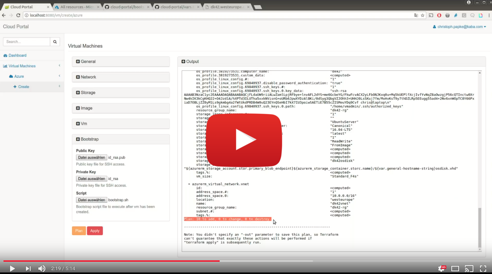

# Cloud Portal

## Overview

Self service web portal for different Cloud platforms like Azure, AWS and VMWare vSphere.

## Features

* LDAP authentication & authorization
* VM provisioning to Azure, AWS and VMWare vSphere using Hashicorp's Terraform
* VM provisioning history
* Automated VM deprovisioning with terraform destroy (VM expiration dates)
* Execute bootstrap scripts for automated server configuration
* Send HTML emails with customizable velocity templates and Terraform log data as attachment
* Responsive WebUI with generic Terraform variable rendering
* Optimized RESTful WebServices and CLI client for CD pipeline integrations
* Dashboards showing important provisioning metrics

## Prerequisites

* [Check infrastructure requirements](docs/infrastructure/README.md)
* [Setup accounts for Cloud providers](docs/cloud-providers/README.md)
* [Install the self service portal](docs/installation/README.md)
* [Add Cloud credentials with an admin user](docs/credentials-admin/README.md)

## Usage

### Client

* See [README.md](modules/cloud-portal-client/README.md#Usage) file of cloud-portal-client module

### Server

* See [README.md](modules/cloud-portal-server/README.md#Usage) file of cloud-portal-server module