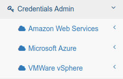
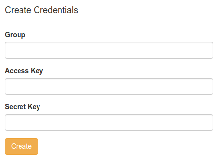

# Credentials Admin

## Introduction

* To be able to provision Cloud resource, the self service portal needs to know which credentials to use
* These credentials can be edited using the **Credentials Admin**
* Only application administrators have enough rights to do this

## Admin Group

* You can set the config property **application.admin.group** in the file **application.properties**
* It is also possible to specify the **application.admin.group** as an environment variable of the Docker container  

## User Interface

If your current user is a member of the admin group you will see an additional menu item called **Credentials Admin**:

Here you can create a set of credentials for your desired LDAP group and Cloud provider (e.g. AWS):
 
